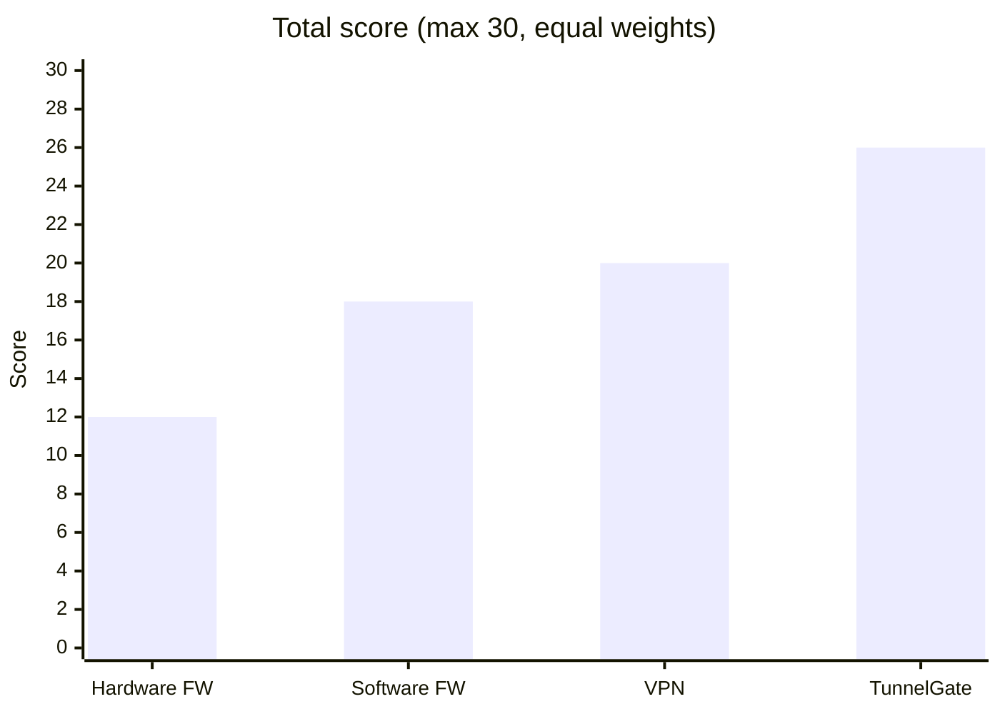

# Secure RDP Access: Hardware Firewall vs Software Firewall vs VPN (without TunnelGate)

_As of 2026-10-02. Costs and scores are approximate; check current vendor pricing._

## Summary

Without TunnelGate there is no single built-in way to reach an RDP server safely from outside the network. You combine a hardware firewall, a host firewall and usually a VPN, and each adds cost or admin work.

RDP (TCP 3389) is heavily attacked and must never be exposed directly. The three classic protections are layers, not rivals:

- **Hardware firewall** guards the network edge.
- **Software firewall** guards each machine.
- **VPN** gives remote users a private path in.

## Option 1: Hardware firewall

A dedicated appliance (Fortinet, Palo Alto, SonicWall, pfSense box, Cisco) at the network edge. For RDP you either forward a port to the server (risky) or allow only fixed source IPs.

| Pros | Cons |
| --- | --- |
| Protects the whole network from one point | Highest upfront cost ($300 to $5,000+) plus yearly licences |
| Dedicated hardware handles deep inspection, IPS, geo-blocking | Needs a network engineer to configure and patch |
| Central rules and logs; malware on a server cannot disable it | Forwarded RDP leaves an open port attackers scan |
| Often bundles a VPN server and failover pairs | IP allow-lists break for staff on changing networks |
| | Cannot see traffic between machines inside the LAN |
| | One appliance needed per site |

**Best fit:** offices and data centres with in-house IT and a security budget.

## Option 2: Software (host-based) firewall

Runs on the server: Windows Defender Firewall, iptables/nftables, ufw, or an endpoint suite. For RDP it limits who may reach port 3389.

| Pros | Cons |
| --- | --- |
| Free or cheap; already built into Windows | Uses the server's own CPU and memory |
| Protects each machine on any network | An attacker with admin rights can turn it off |
| Per-app and per-user rules via Group Policy / MDM | Rules drift when managed machine by machine |
| Stops lateral movement between internal machines | Does not hide the server; an allowed port is still reachable |
| Deploys in minutes | Weak against volumetric DDoS |
| | Filters only; gives remote users no way in |

**Best fit:** a second layer on every server and laptop, never the only control for internet-facing RDP.

## Option 3: VPN

An encrypted tunnel (WireGuard, OpenVPN, IPsec) from the user's device into the private network. RDP runs over the private address, so 3389 is never public.

| Pros | Cons |
| --- | --- |
| Port 3389 stays closed to the internet | Gateway must be run, patched and kept online; often attacked |
| Encrypts all traffic, not only RDP | Every user needs a client, key and onboarding |
| Reaches every internal resource, not just RDP | Network-wide access: one stolen laptop can reach a lot |
| Mature; free open-source options exist | Adds latency; drops on poor links |
| Works well with MFA and certificates | Often blocked on hotel and airport Wi-Fi |
| | Two steps: connect VPN, then open RDP |

**Best fit:** teams needing broad access to many internal systems and staff to run the gateway.

## Side-by-side comparison

| Factor | Hardware firewall | Software firewall | VPN |
| --- | --- | --- | --- |
| Where it works | Network edge | On each machine | Tunnel from device to network |
| Upfront cost | High ($300 to $5,000+) | Free to low | Low to medium |
| Ongoing cost | Licence and support | Admin time | Server upkeep, client management |
| Setup effort | High; network skills | Low per machine, high at scale | Medium |
| RDP port hidden from internet | No (unless paired with VPN) | No | Yes, but VPN port is exposed |
| Remote user experience | Poor; IP allow-lists break | n/a | Good, but needs connect step |
| Blocks lateral movement | No | Yes | No, unless segmented |
| Tamper risk | Low | High if admin compromised | Medium |
| Scales to many users | Hard; rules grow | Hard; per-machine drift | Medium |
| Main weakness | Cost and exposed port | Easy to bypass or misconfigure | Broad access; gateway is a target |

## Scores (0 to 5, higher is better)

Judgement call for a small team running RDP, not measured data.

| Criterion | Hardware FW | Software FW | VPN | TunnelGate |
| --- | ---: | ---: | ---: | ---: |
| Security | 4 | 3 | 4 | 4 |
| Low cost | 1 | 5 | 4 | 4 |
| Easy setup | 2 | 4 | 3 | 4 |
| User experience | 2 | 3 | 3 | 5 |
| Scalability | 2 | 2 | 3 | 4 |
| Hides server | 1 | 1 | 3 | 5 |
| **Total (of 30)** | **12** | **18** | **20** | **26** |

## Three-year cost estimate (example: 25 users, 1 site, $40/h admin)

Assumes a ~$900 appliance plus $350/year licence per site, a $25/month VPN host, and Cloudflare Zero Trust free up to 50 users (about $7/user/month beyond). Admin time per month: hardware 4 h per site, software 2 h, VPN 3 h, TunnelGate 1 h.

| Option | Equipment and licences | Admin time (36 months) | 3-year total |
| --- | ---: | ---: | ---: |
| Hardware firewall | $1,950 | $5,760 | $7,710 |
| Software firewall | $0 | $2,880 | $2,880 |
| VPN | $900 | $4,320 | $5,220 |
| TunnelGate | $0 | $1,440 | $1,440 |

## Where TunnelGate fits

TunnelGate removes the biggest weakness of all three options, an inbound open port. It connects through a Cloudflare Zero Trust tunnel and opens RDP in one click.

- [x] No port forwarding, no VPN gateway to patch, no source-IP allow-lists
- [x] Access per server rather than whole network
- [x] Cloudflare Access can add identity checks and logging (free plan keeps logs 24 hours; paid plans longer)
- [x] One click for the user; works from changing networks over HTTPS
- [ ] Does not replace a host firewall (keep one on each server)
- [ ] Does not replace a perimeter firewall for the rest of the LAN
- [ ] Depends on Cloudflare availability and a Cloudflare account and policy setup
- [ ] Covers remote desktop only, not general network access like a full VPN

## Which should I pick? (checklist)

Tick what applies, then read the matching line.

- [ ] Small team, no dedicated network engineer → favour **TunnelGate** or **software firewall**
- [ ] Tight budget → **software firewall**, then **TunnelGate**
- [ ] Server must not be visible on the internet → **TunnelGate**, then **VPN**
- [ ] Staff connect from home, travel or mobile networks → **TunnelGate**
- [ ] Many users or many servers → **TunnelGate** or **VPN**
- [ ] Need broad access to many internal systems → **VPN**
- [ ] Need to protect the whole office LAN → **hardware firewall**

## Recommendation

Keep the software firewall on every machine, keep a hardware firewall at the office edge, and replace the VPN-plus-open-port approach for RDP with TunnelGate. Use a VPN only where staff need broad access to many internal systems.

## Sources

Checked 2026-10-02. Claims in this doc that these pages support:

| Claim | Source |
| --- | --- |
| Internet-exposed RDP must be removed from the public internet or placed behind zero-trust access controls | [CISA BOD 23-02: Mitigating the Risk from Internet-Exposed Management Interfaces](https://www.cisa.gov/news-events/directives/binding-operational-directive-23-02) and its [implementation guidance](https://www.cisa.gov/news-events/directives/bod-23-02-implementation-guidance-mitigating-risk-internet-exposed-management-interfaces) |
| RDP is exploited for ransomware and lateral movement; remove direct exposure | [CIS: CISA's updated ransomware guidance](https://www.cisecurity.org/insights/blog/renew-your-ransomware-defense-with-cisas-updated-guidance) (summary of the CISA StopRansomware Guide) |
| Cloudflare Tunnel uses outbound-only connections, so no inbound port or public IP is needed | [Cloudflare One: Connectivity options](https://developers.cloudflare.com/cloudflare-one/networks/connectivity-options/) and [Protect your origin server](https://developers.cloudflare.com/fundamentals/security/protect-your-origin-server/) |
| RDP can be published through Cloudflare Tunnel | [Cloudflare One: RDP over Tunnel](https://developers.cloudflare.com/cloudflare-one/networks/connectors/cloudflare-tunnel/use-cases/rdp/) and [browser RDP](https://developers.cloudflare.com/cloudflare-one/networks/connectors/cloudflare-tunnel/use-cases/rdp/rdp-browser/) |
| Cloudflare Access records who connected, when, and whether they were allowed | [Access authentication logs](https://developers.cloudflare.com/cloudflare-one/insights/logs/dashboard-logs/access-authentication-logs/) |
| Zero Trust is free up to 50 users, about $7 per user per month beyond that | [Cloudflare Zero Trust pricing](https://en-us.www.cloudflare.com/teams-pricing/) (official; the free-plan limits such as 24-hour log retention come from third-party summaries such as [Costbench](https://costbench.com/software/business-vpn/cloudflare-zero-trust/free-plan/), so confirm on the official page) |
| VPN gateways are frequently exploited | [CISA Known Exploited Vulnerabilities catalog](https://www.cisa.gov/known-exploited-vulnerabilities-catalog) (search for Fortinet, Ivanti/Pulse, Palo Alto VPN entries; link not opened in this session) |

Not backed by a source (my own estimates): the 0–5 scores, the admin-hours figures, and the appliance and VPN host prices in the cost table. Replace them with the client's own quotes before presenting.
